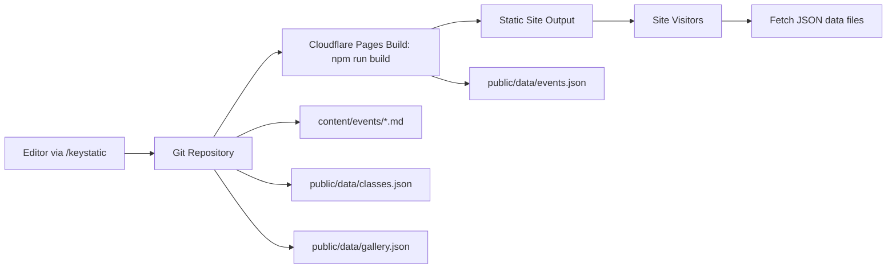

# Seattle Tabla Institute Website

## Summary
Static, mobile-first website for Seattle Tabla Institute (STI) with Astro +
Keystatic for non-developer updates. Content for events, classes, and the media
gallery is managed via Markdown and JSON files in the repo and deployed on
Cloudflare Pages.

## Overview
- Astro-powered static site with fast load times and mobile-friendly layouts.
- Keystatic CMS enables non-developers to update:
  - Events (Markdown)
  - Class schedules/pricing (JSON)
  - Gallery photos and YouTube links (JSON)
- Build script compiles event Markdown into `public/data/events.json`.
- Cloudflare Pages runs `npm run build` on deploy.

## Architecture


## Local Setup
Install dependencies:
```bash
npm install
```

Build event data:
```bash
npm run build
```

Preview locally:
```bash
npm run dev
```
Open `http://localhost:4321`.

Build preview:
```bash
npm run preview
```

## Content Locations
- Events (Markdown): `content/events/`
- Events output (JSON): `public/data/events.json` (generated)
- Class data (JSON): `public/data/classes.json`
- Gallery data (JSON): `public/data/gallery.json`
- CMS entry: `/keystatic`

## Cloudflare Pages Deployment
Project name: `seattle-tabla-institute`

Build settings:
- Build command: `npm run build`
- Output directory: `dist`
- KV binding: `SESSION`

Environment variables:
- Set these in Cloudflare Pages:
  - `KEYSTATIC_GITHUB_CLIENT_ID`
  - `KEYSTATIC_GITHUB_CLIENT_SECRET`
  - `KEYSTATIC_SECRET`
  - `PUBLIC_KEYSTATIC_GITHUB_APP_SLUG`
- If you already have a Keystatic GitHub App, install it on this repo and reuse
  the same client ID/secret and app slug.

## Notes
- Update PayPal links when ready.
- Replace gallery placeholders in `assets/uploads/`.

## Ad Grants website readiness checklist
- HTTPS-only links and assets
- Clear nonprofit mission and 501(c)(3) status visible site-wide
- Contact information available on every page
- Policies page includes privacy, terms of use, and refund/cancellation policy
- No ad-network ads or commercial-only messaging
- Clear navigation with dedicated Programs, Events, and Join pages
- Per-page metadata, canonical URLs, sitemap.xml, and robots.txt in place
